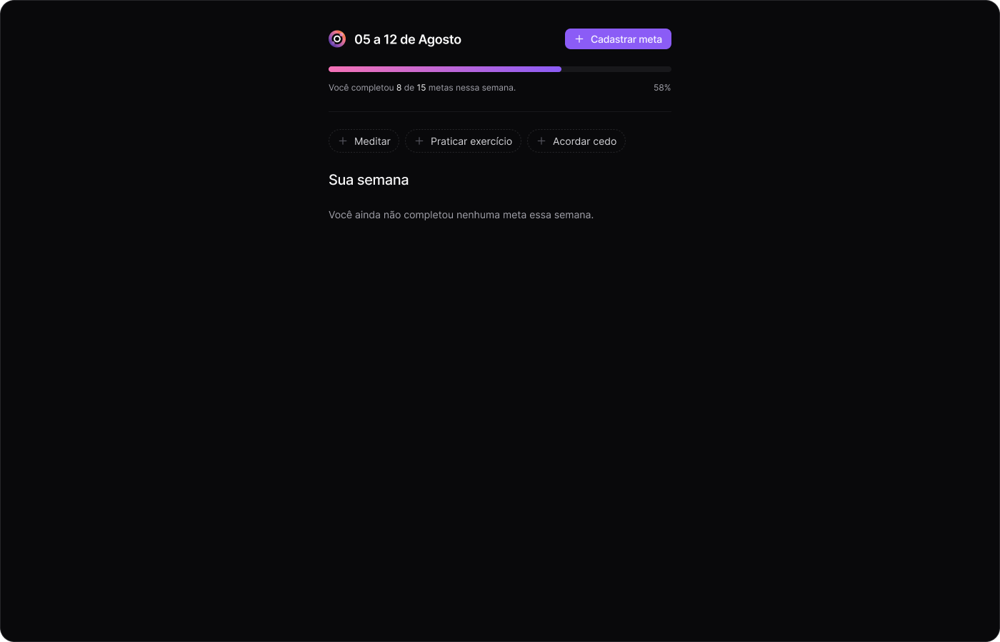
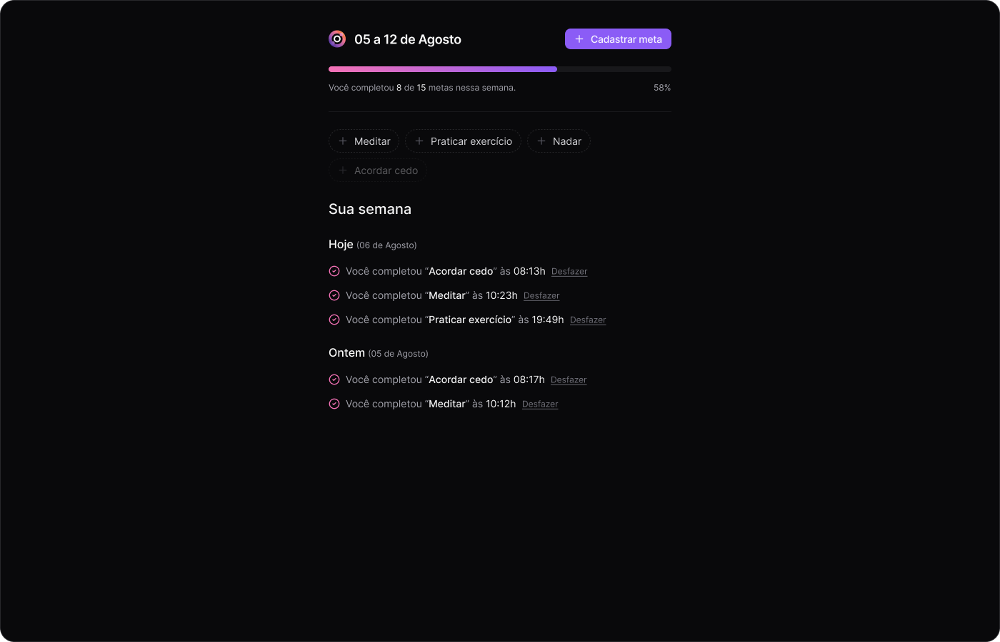

<h1 align="center"> In orbit </h1>

 

  

  

  

  

## 🚀 Tecnologias

Esse projeto está sendo desenvolvido com as seguintes tecnologias:

 ## Backend

- Fastify
-  Zod
- Nodejs
- Docker Compose
- Drizzle ORM

## Frontend

- Typescript
- Reactjs
- JavaScript
- TailwindCSS
- HTML

## 💻 Projeto

In orbit projeto que é basicamente controle me metas pessoais, desenvolvido pela Rocketseat no evento NLW Pocket: Javascript Full-stack Intermediário

